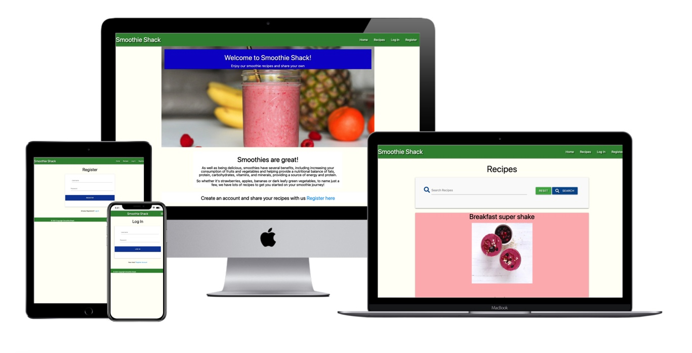

# Smoothie Shack

## Milestone Project 3 - Python and Data Centric Development

Website live link - https://smoothieshack.herokuapp.com/ 

Github link - https://github.com/AndrewDarwin/ms3smoothieshack 

Smoothie Shack is a recipe website for people who love smoothies. The website is a place where users can be inspired, view and search for recipes, as well as add their own recipes.
Users are welcome to create an account and add their smoothie recipes. If the user has an account, he/she can add, edit and delete their recipes.

 
