# Smoothie Shack

## Milestone Project 3 - Python and Data Centric Development

Website live link - https://smoothieshack.herokuapp.com/ 

Github link - https://github.com/AndrewDarwin/ms3smoothieshack 

Smoothie Shack is a recipe website for people who love smoothies. The website is a place where users can be inspired, view and search for recipes, as well as add their own recipes.
Users are welcome to create an account and add their smoothie recipes. If the user has an account, he/she can add, edit and delete their recipes.

 

Mockup image taken from - https://techsini.com/multi-mockup 

# 1. User Experience (UX)

* Constructing a full-stack site/app that uses HTML, CSS, JavaScript, Python+Flask and MongoDB.

* Creating an easy to navigate site/app that serves as a platform where users can be inspired for smoothie ideas and where they can share their smoothie recipes.

* Designing a full-stack site/app that allows users to manage data and can make use of CRUD (create, read, update and delete) for the recipes.

## User stories

### First-time visitor goals:

* As a first time visitor, I want to be able to navigate easily through the website, so I can find everything easily.

* As a first time visitor, I want to be able to understand the intent of the page

* As a first time visitor, I want to see an overview of all recipes, so I can be inspired by all recipes.

* As a first time visitor, I want to be able to browse and search for recipes based on words, so I can find recipes easily. (For example, I can search the word pineapple and all recipes with the ingredient pineapple or pineapple in the recipe name will appear.)

* As a first time visitor, I want to register an account on the website, so I can share my recipes on Smoothie Shack.

* As a first time visitor, I want to be able to visit the website on every device, so that I can look at the website on desktop, mobile and tablet.

### Registered User goals:

All the goals of first-time visitors also apply for registered users. There are additional user stories to the site members because they have more access to the website (when logged in).

* As a registered user, I want to add my recipes, so I can share my recipes on the site.

* As a registered user, I want to be able to view my recipes that I’ve submitted to the site.

* As a registered user, I want to edit my recipes, so I can update information in the recipe.

* As a registered user, I want to delete my recipes, so I can remove the recipe for whatever reason.

* As a registered user, I want to login to my profile, so I have access to my recipes.

* As a registered user, I want to be able to logout of my profile.

## 5 Planes UX

### Strategy

My goal was to develop an appealing recipe website for people who love smoothies. Smoothie Shack is a place where users can be inspired, view and search for recipes, as well as add their own recipes. I aimed to have a nice layout and clean design - consistent in style and colour throughout.

### Scope

For ease of use, Smoothie Shack contains a Navigation bar which is simple and easy to navigate, as well as a search Function. There are also functions to Function to add a recipe, edit a recipe and delete a recipe. The recipes can be only edited/deleted by the creator. The website is visually appealing by use of smoothie images, and nice colours which do not make the text unreadable. 

### Structure

I structured the layout in a user friendly interface and the content in an easily readable way for the user. There’s a Navigation bar at the top of the page with responsive navigation - adjusting for mobile for ease of use, and a Footer at the bottom of every page. All images and features are responsive for mobile and desktop viewing. 

### Skeleton

Here below are some wireframes I created for Smoothie Shack;

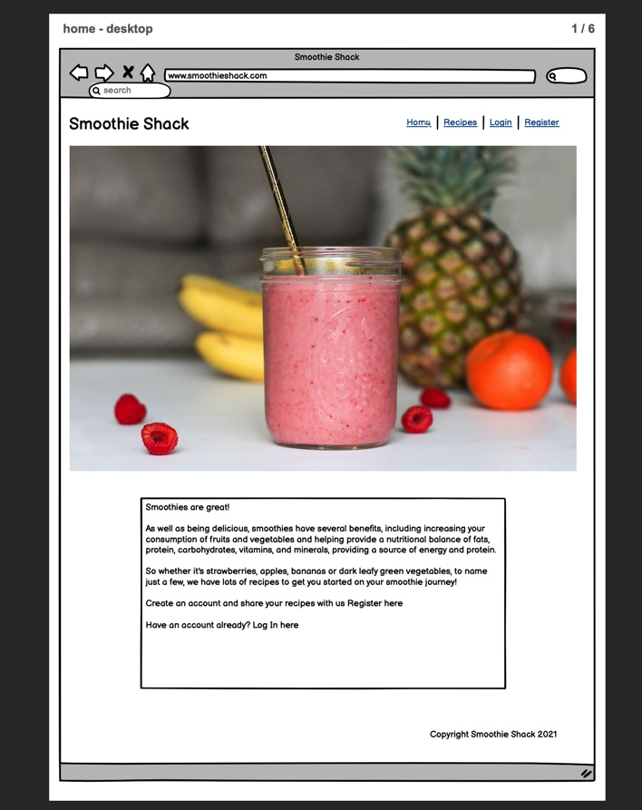 

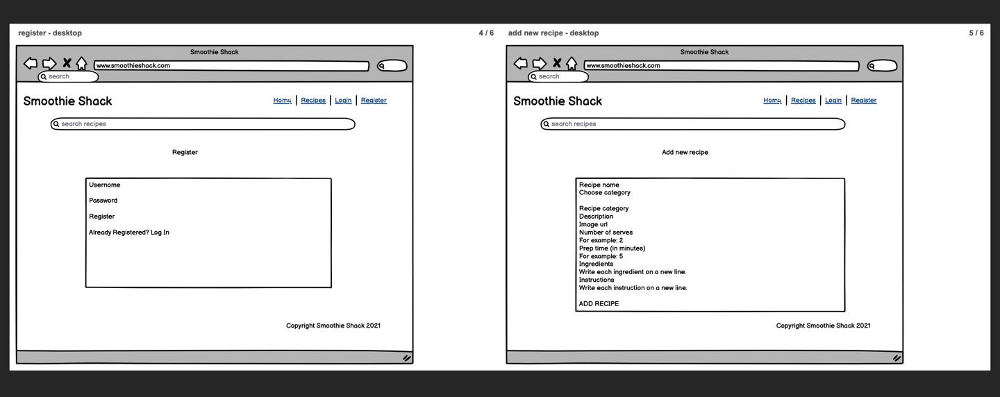 

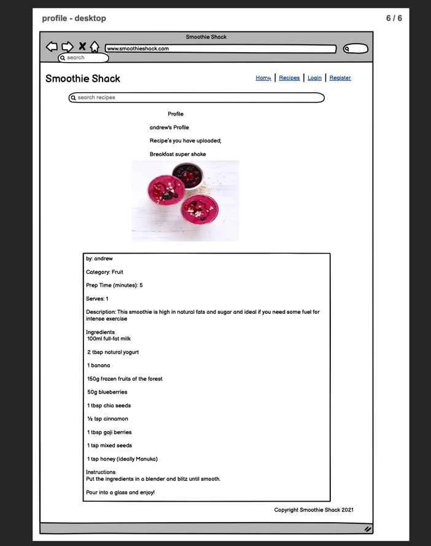 

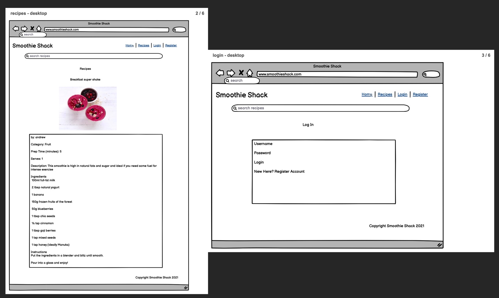 

### Surface

As the website is based on smoothies, I chose a green colour for the header and footer - this colour is synonymous with smoothies. I have chosen a night bright and stark colour in blue on the home page as the background for the introduction text, to draw in user’s eyes to the name of the site and what the site represents. I have designed the site with lots of colours that are similar to different smoothies, be it in the design, or the images that I have used. The colours are kept in harmony with the images - the hero image of the home page is one of a smoothie and some fruit - with lots of vibrant colour. The background of the recipes content is pink. Similarly, this colour was chosen because it is synonymous with smoothies. Non-text elements have alt text attributes (or the equivalent (eg role=“img” aria-label=“”) to cater for the visually impaired. I chose Lato as the font throughout, as it offers a beautiful font, and believe it fits nicely with the site. 

### Database Model

The project has three collections in the database. The database structure in MongoDB is as follows:

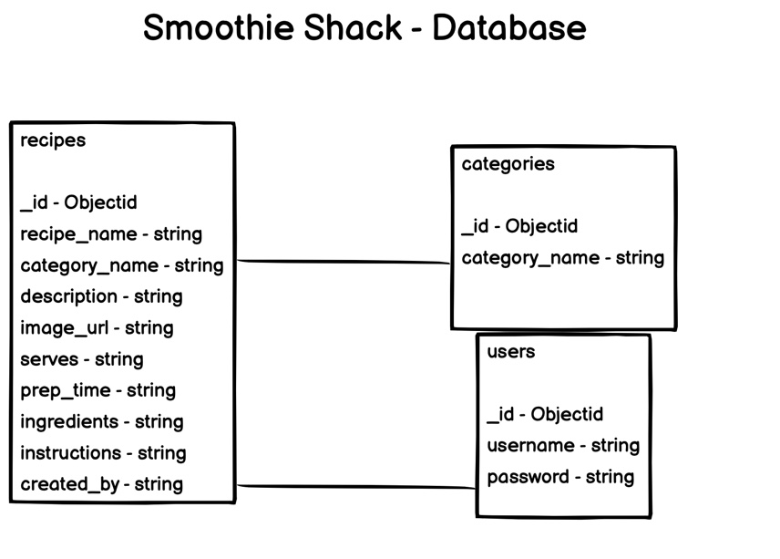 

# 2. Features

### Design

* A simple and consistent layout.

* Clear navigation throughout the website by using the navigation bar.

### General

* The index page shows a hero image of a smoothie and fruit, as well as an introduction to the benefits of smoothies, and a call to action to either register or log in. 

### Recipes

* Recipes can be created, read, updated and deleted (CRUD) by the users.

* Users can search for recipes with the search bar.

* Users have access to their profile, with an overview of all their recipes.

* Recipes include recipe Name, Category, Prep Time (minutes), Serves, Description, Ingredients and Instructions.

### Signup, login and logout

* Users can register to create a new account.

* Users can login with existing account. 

* User can easily log out.

* If a user creates a new account, logs in or logs out, a flashed message will appear with the action the user has done.

#  3. Technologies used

## Languages used

* HTML

* CSS

* Javascript

* jQuery

* Python

## Frameworks, libraries & Other

* Gitpod

* Git

* Github

* Materilize

* MongoDB

* Heroku

* Flask

* Jinja

* Werkzeug

# 4. Testing

* Chrome DevTools - to test responsiveness. App responding good on all devices.

* W3C Markup Validation Service - to check for errors in HTML code. No errors found.

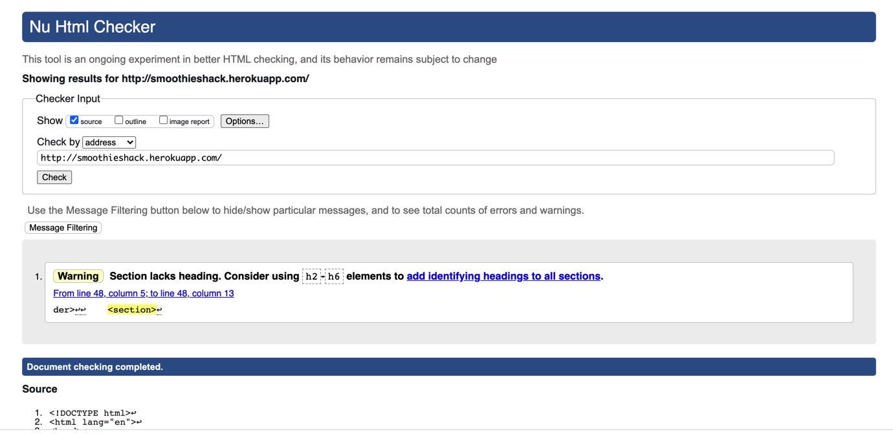 

* W3C CSS validator - to check for errors in CSS code. No errors found.

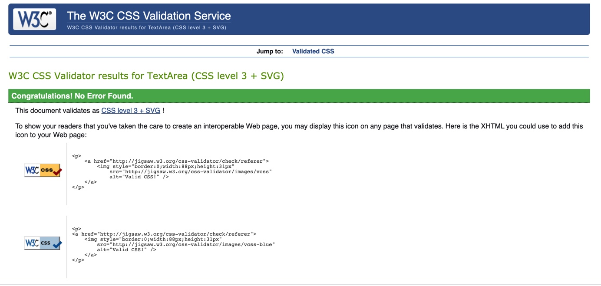 

* JShint - to check for errors in Javascript code. No errors found.

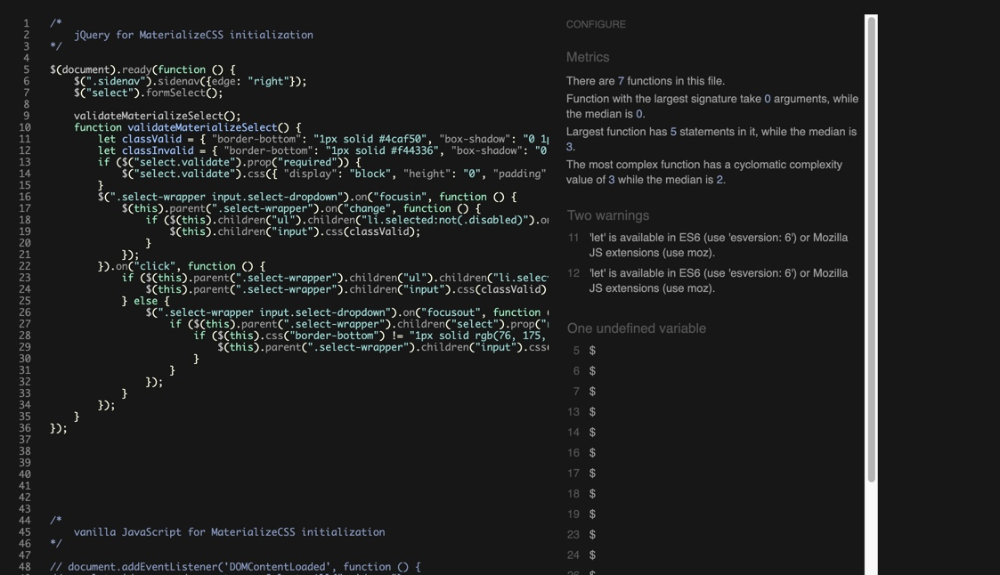 

* PEP8 - to check for errors in Python code. No errors found.

## Testing User Stories from User Experience (UX) Section

# First-time visitor goals

* As a first time visitor, I want to be able to navigate easily through the website, so I can find everything easily.

The first time visitor can navigate through the website with the navbar. The site has been designed to be fluid and easy to navigate. At the top there is a clean navigation bar, each link describes what section of the site they will end up at clearly. For the mobile visitors there is a hamburger menu.

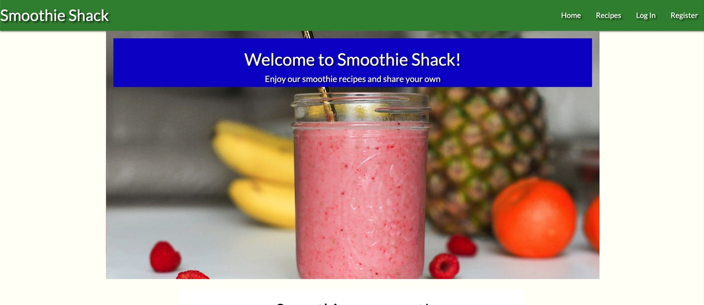 

* As a first time visitor, I want to see all site recipes, so I can be inspired by all recipes.

The first time visitor can visit all recipes on the site by clicking on the Recipes page, and scrolling down the page to view all of the recipes uploaded.

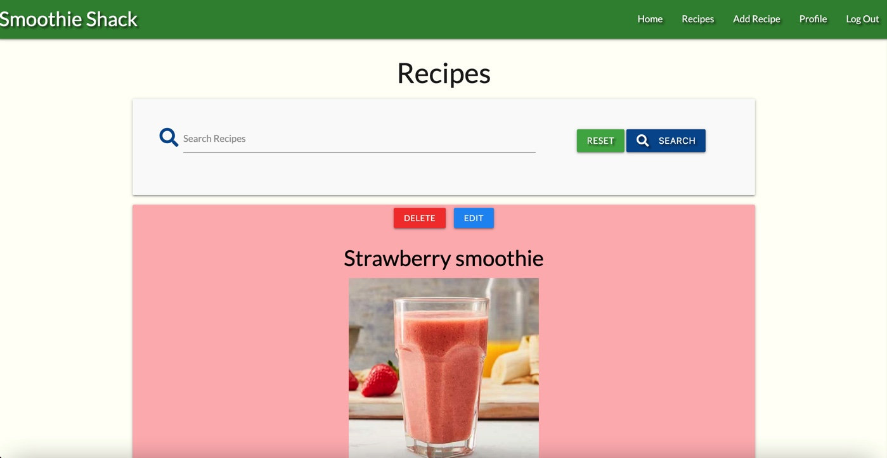 

* As a first time visitor, I want to be able to browse and search for recipes based on words, so I can find recipes easily. (For example, I can search the word banana and all recipes with the ingredient banana or banana in the recipe name will appear.)

On the recipes pages there is a searchbar, where first time visitors can search for words. The search is based on the recipe name or the ingredients.

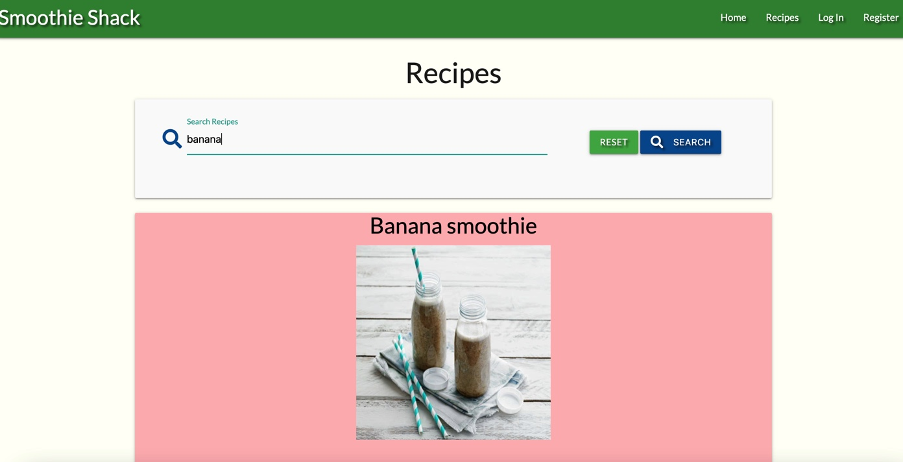 

* As a first time visitor, I want to register an account on the website, so I can share my recipes on Smoothie Shack.

The first time visitor can navigate to the Register page in the top navbar to register an account. There is also a CTA on the home page to register an account. 

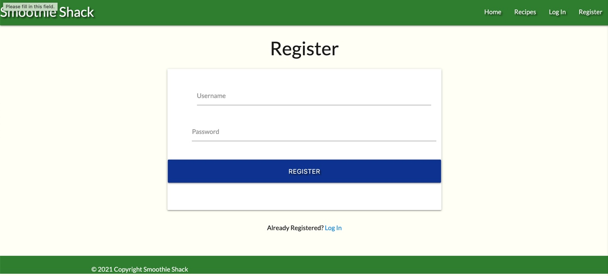 

* As a first time visitor, I want to be able to visit the website on every device, so that I can look at the website on desktop, mobile and tablet.

The first time visitor can visit the website on desktop, laptop, tablet and mobile phone.

# Registered User goals:

All the goals of first-time visitors also apply for registered users. There are additional user stories to the site members because they have more access to the website (when logged in).

* As a registered user, I want to add my recipes, so I can share my recipes on the site.

Registered users can add recipes by clicking on the Add Recipe page, and then filling in the form with their recipe details. 

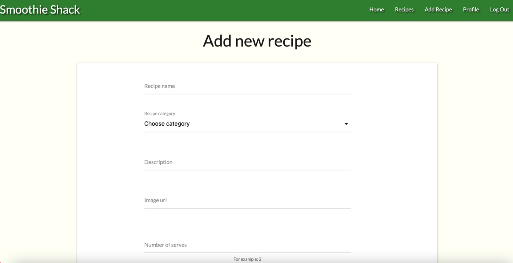

* As a registered user, I want to be able to view my recipes that I’ve submitted to the site

A registered user can view their recipes by clicking on the Profile page, where they’ll see all of their created recipes. 

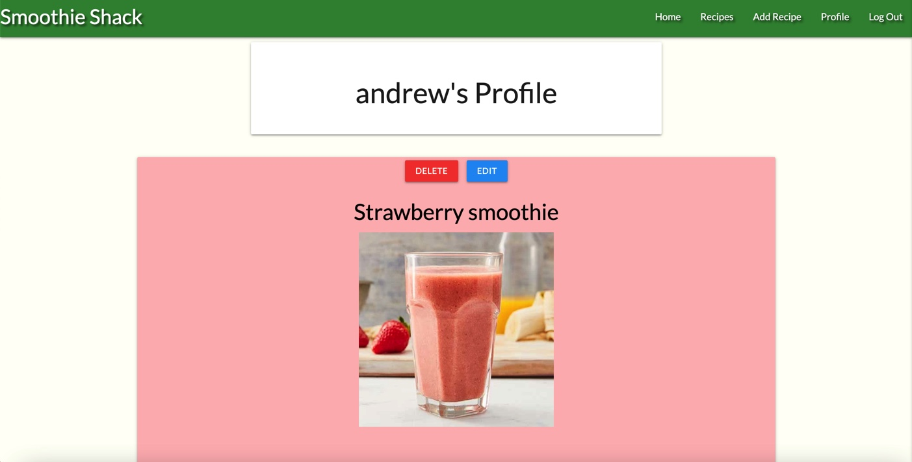

* As a registered user, I want to edit my recipes, so I can update information in the recipe.

A registered user has a profile page. On the Profile page, there is an overview of all recipes made by the user. Above each recipe there is an edit button. If the site member clicks on the edit button they will navigate to the edit recipe form, where they can edit their recipe by editing the form. This edit function is also available on the Recipes page for the option to edit the user’s recipes. 

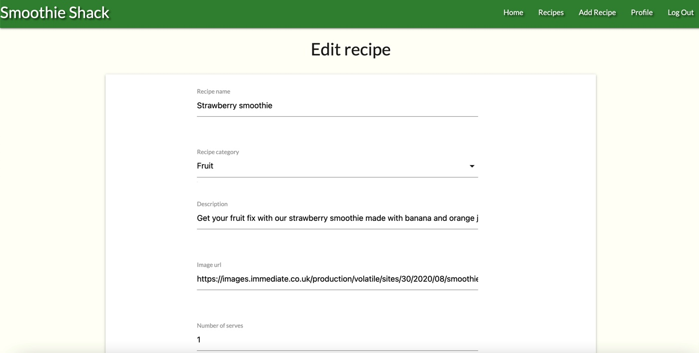

* As a registered user, I want to delete my recipes, so I can remove the recipe for whatever reason.

A registered user can delete a recipe on the Profile page. There is an overview of all recipes by the user on the profile page. There is a button above each recipe, to delete the recipe. This delete function is also available on the Recipes page for the option to delete the user’s recipes.

* As a registered user, I want to login to my profile, so I have access to my recipes.

A registered user can login by clicking on the Log In page at the top navbar on the website.

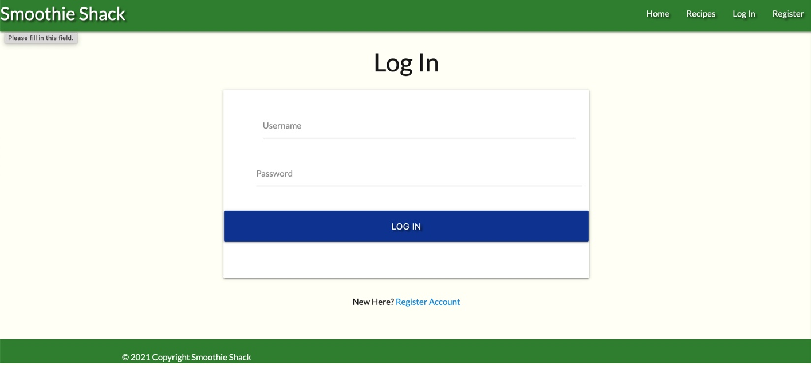

* As a registered user, I want to be able to logout of my profile.

If a registered user is logged in they can logout by clicking on the Logout page at the top navbar.

